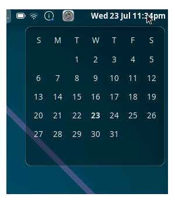
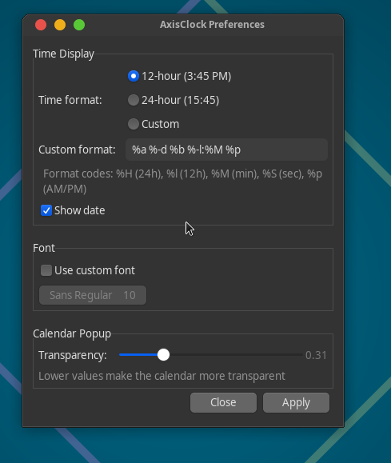

Enjoying the project? If you'd like to support its future development, you can do so via <a href="https://ko-fi.com/axisos">
  
</a> or <a href="https://paypal.me/AxisOS">
  
</a> Any support is greatly appreciated!

# xfce4-axisclock-plugin




A macOS-style clock plugin for the Xfce panel, featuring a clean design and calendar popup.

## About

AxisClock is a lightweight clock plugin for the Xfce desktop environment that brings the elegant macOS clock style to your panel. It features a customizable time display format and a beautiful calendar popup with transparency support.

**Author:** Kamil 'Novik' Nowicki  
**Email:** novik@axisos.org  
**Website:** https://axisos.org  
**Repository:** https://github.com/Axis0S/xfce4-axisclock-plugin  
**Version:** 0.1  
**License:** GPL-2.0+  

## Features

- **macOS-style Design**: Clean and elegant clock display that matches the macOS aesthetic
- **Calendar Popup**: Click on the clock to show a beautiful calendar widget
- **Customizable Time Format**: Choose between 12-hour, 24-hour, or custom time formats
- **Theme Support**: Automatically adapts to your system's light or dark theme
- **Transparency Control**: Adjust the calendar popup transparency to your preference
- **Font Customization**: Option to use custom fonts for the clock display
- **Lightweight**: Minimal resource usage, perfect for any system

## Dependencies

- GTK+ 3.22 or higher
- libxfce4panel 4.12 or higher
- libxfce4util 4.12 or higher
- libxfce4ui 4.12 or higher
- xfconf 4.12 or higher
- Meson build system

## Installation

### Pre-built Packages

Ready-to-install packages are available in the [Releases](https://github.com/Axis0S/xfce4-axisclock-plugin/releases) section for the following distributions:

#### Debian/Ubuntu
```bash
# Download the .deb package from releases
wget https://github.com/Axis0S/xfce4-axisclock-plugin/releases/download/v0.1/xfce4-axisclock-plugin_0.1_amd64.deb

# Install the package
sudo dpkg -i xfce4-axisclock-plugin_0.1_amd64.deb

# Install any missing dependencies
sudo apt-get install -f
```

#### Fedora/RHEL
```bash
# Download the .rpm package from releases
wget https://github.com/Axis0S/xfce4-axisclock-plugin/releases/download/v0.1/xfce4-axisclock-plugin-0.1-1.fc42.x86_64.rpm

# Install the package
sudo dnf install xfce4-axisclock-plugin-0.1-1.fc42.x86_64.rpm
```

#### Arch Linux
```bash
# Download the package from releases
wget https://github.com/Axis0S/xfce4-axisclock-plugin/releases/download/v0.1/xfce4-axisclock-plugin-0.1-1-x86_64.pkg.tar.zst

# Install the package
sudo pacman -U xfce4-axisclock-plugin-0.1-1-x86_64.pkg.tar.zst
```

All packages are signed with my GPG key. See the Package Signing section below for verification instructions.

### Package Signing

All packages are signed with my GPG key for security verification.

**GPG Key ID:** `62F091E70A090877`  
**Fingerprint:** `A192 9394 DC6B C602 A765 4955 62F0 91E7 0A09 0877`

#### Downloading the GPG Key

You can download my GPG key from the Ubuntu keyserver:

```bash
# Download the key
gpg --keyserver keyserver.ubuntu.com --recv-keys 62F091E70A090877

# Or using the full fingerprint (recommended)
gpg --keyserver keyserver.ubuntu.com --recv-keys A1929394DC6BC602A765495562F091E70A090877
```

#### Adding the GPG Key to Your System

**Debian/Ubuntu:**
```bash
# Export the key and add it to apt's keyring
gpg --armor --export 62F091E70A090877 | sudo tee /etc/apt/trusted.gpg.d/axisos.asc

# For newer systems using signed-by (recommended)
sudo mkdir -p /etc/apt/keyrings
gpg --armor --export 62F091E70A090877 | sudo tee /etc/apt/keyrings/axisos.gpg
```

**Fedora/RHEL:**
```bash
# Export and import the key to RPM database
gpg --armor --export 62F091E70A090877 > axisos.asc
sudo rpm --import axisos.asc
rm axisos.asc
```

**Arch Linux:**
```bash
# Add the key to pacman's keyring
sudo pacman-key --recv-keys 62F091E70A090877
sudo pacman-key --lsign-key 62F091E70A090877

# Or using the full fingerprint
sudo pacman-key --recv-keys A1929394DC6BC602A765495562F091E70A090877
sudo pacman-key --lsign-key A1929394DC6BC602A765495562F091E70A090877
```

#### Verifying Package Signatures

After adding the key, you can verify downloaded packages:

```bash
# For .deb packages
dpkg-sig --verify package.deb

# For .rpm packages
rpm --checksig package.rpm

# For Arch packages
pacman-key --verify package.pkg.tar.zst.sig

# For source tarballs
gpg --verify package.tar.gz.asc package.tar.gz
```

### From Source

1. Clone the repository:
```bash
git clone https://github.com/Axis0S/xfce4-axisclock-plugin.git
cd xfce4-axisclock-plugin
```

2. Build and install:
```bash
./install.sh
```

3. Restart the Xfce panel:
```bash
xfce4-panel -r
```

4. Add the plugin to your panel:
   - Right-click on the panel
   - Select "Panel" → "Add New Items"
   - Find "AxisClock" in the list and add it

## Configuration

Right-click on the clock and select "Properties" to access the configuration dialog:

### Time Display
- **Time Format**: Choose between 12-hour (3:45 PM), 24-hour (15:45), or custom format
- **Custom Format**: Use standard strftime format codes (e.g., %H:%M for 24-hour time)
- **Show Date**: Toggle to display the date along with the time

### Font
- **Use Custom Font**: Enable to select a custom font for the clock display
- **Font Selection**: Choose your preferred font family and size

### Calendar Popup
- **Transparency**: Adjust the transparency level of the calendar popup (0.1 to 1.0)
  - Lower values make the calendar more transparent
  - Default is 0.95 (95% opaque)

## Usage

- **Left Click**: Show/hide the calendar popup
- **Right Click**: Access the context menu with preferences and about options

The calendar popup will automatically close when you click outside of it.

## Building from Git

If you're building from a git checkout, you'll need:
- git
- meson (>= 0.50.0)
- ninja
- gcc or clang
- pkg-config

## Troubleshooting

### Calendar popup appears in taskbar
This has been fixed in version 0.1. The calendar now properly sets window hints to prevent taskbar appearance.

### Theme colors not applied
The plugin automatically detects your system theme. If colors aren't applied correctly, try restarting the panel with `xfce4-panel -r`.

## Contributing

Contributions are welcome! Please feel free to submit pull requests or report issues on the [GitHub repository](https://github.com/Axis0S/xfce4-axisclock-plugin).

## Copyright

Copyright © 2025 Kamil 'Novik' Nowicki

This program is free software; you can redistribute it and/or modify it under the terms of the GNU General Public License as published by the Free Software Foundation; either version 2 of the License, or (at your option) any later version.

This program is distributed in the hope that it will be useful, but WITHOUT ANY WARRANTY; without even the implied warranty of MERCHANTABILITY or FITNESS FOR A PARTICULAR PURPOSE. See the GNU General Public License for more details.

## Acknowledgments

Thanks to the Xfce development team for providing excellent documentation and APIs for panel plugin development.
